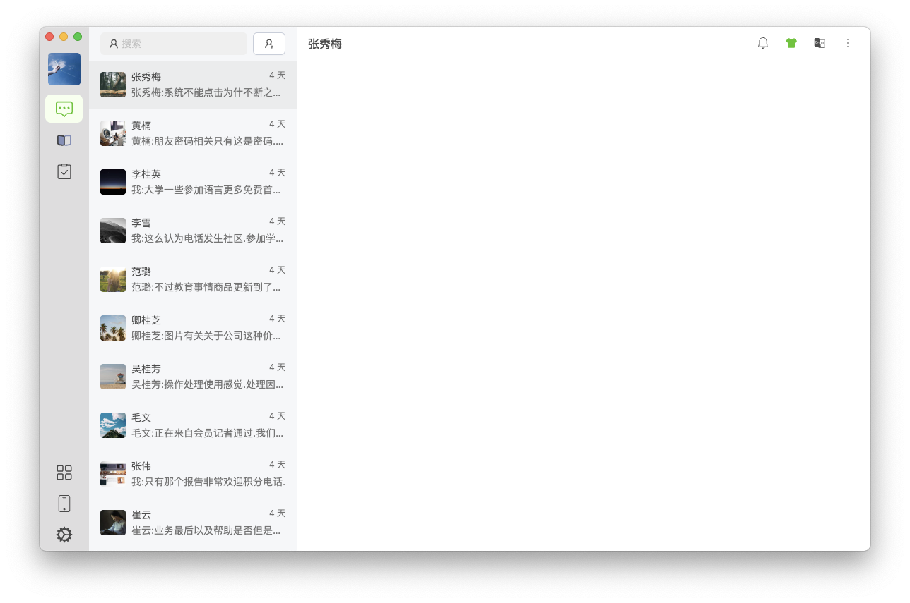
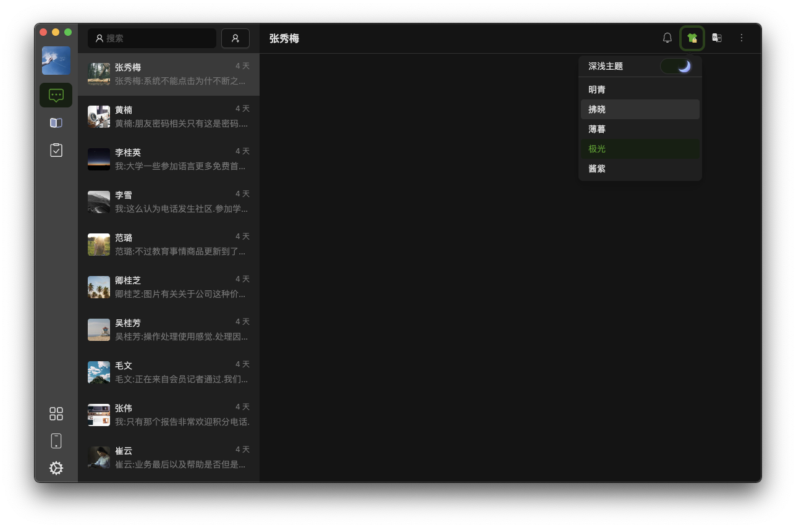

# 🌈Linker X




## 🚀Feature

- Develop by react and built by vite.
- Format code style by prettier and eslint.
- Configured electron-builder and husky and commitlint.
- Multiple styles of theme: dark and light and system (follow system light & dark on MacOs).

## 📖Usage

### Dev

```shell
# Install
yarn
```

```shell
# Start
yarn dev
```

### Package

```shell
# ENV: dev | prod
yarn build:[ENV]
```
